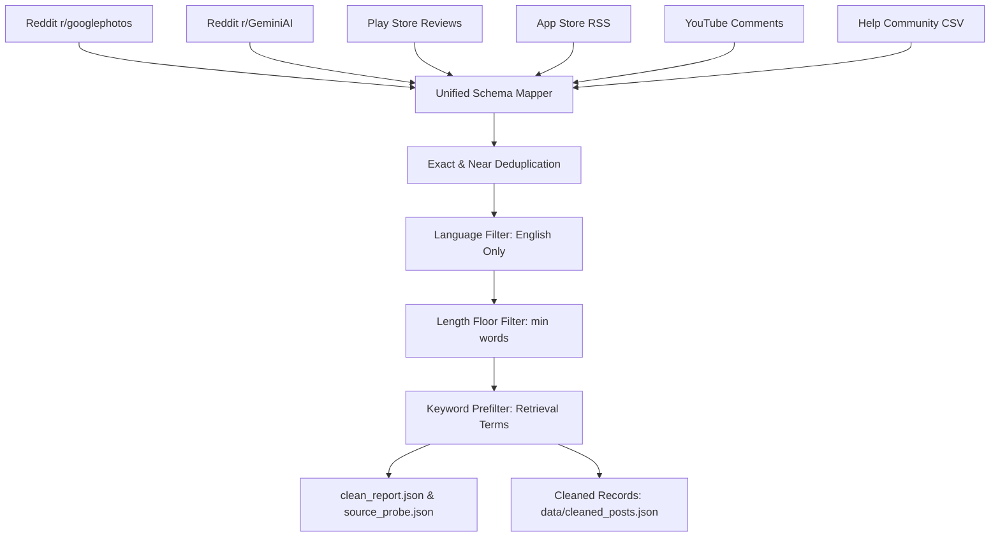
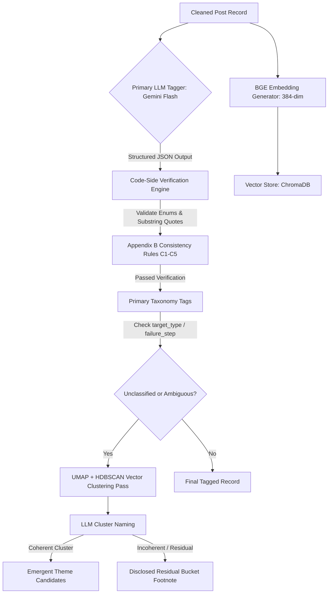
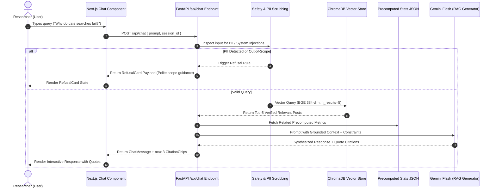
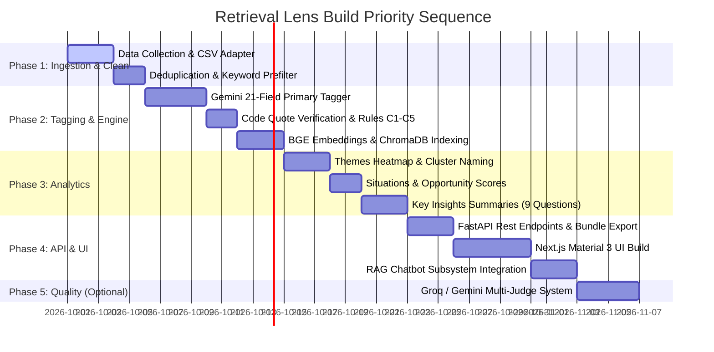

# Architecture Specification: AI Discovery Engine ("Retrieval Lens")
**System Architecture & Subsystem Design Document**  
**Version:** 2.0.0  
**Target Product:** Google Photos Retrieval Discovery Engine ("Retrieval Lens")  
**Scope:** Complete End-to-End Pipeline, Backend Service (FastAPI), RAG Chatbot, Multi-LLM Judge System, and Frontend (Next.js / Material 3)

---

## 1. Executive Summary & Architectural Overview

### 1.1 Core Strategic Mission
The **AI Discovery Engine ("Retrieval Lens")** is an enterprise-grade research and analytics platform designed to solve a strategic product challenge for Google Photos: understanding **why photo retrieval fails when users have incomplete visual memories**.

While traditional search engines index explicit metadata and visual tags for exact keyword queries (e.g., "Paris", "Dog"), retrieval breaks down when users remember contextual, vague, or subjective clues (e.g., "that small cafe during our Goa trip" or "picture of the medicine I took last year"). The Discovery Engine ingests public feedback at scale, standardizes and cleans it, applies multi-layered LLM taxonomy tagging, clusters emergent failure patterns, powers an evidence-grounded RAG chatbot, and exports self-describing research bundles.

```
                  +-----------------------------------------------------------------------+
                  |                      MULTI-SOURCE DATA INGESTION                      |
                  | Reddit (r/googlephotos, r/GeminiAI) | Play Store | App Store | CSV   |
                  +-----------------------------------+-----------------------------------+
                                                      |
                                                      v
                  +-----------------------------------------------------------------------+
                  |                     CLEANING & PRE-FILTERING ENGINE                   |
                  | Deduplication | Lang ID | Length Floor | Keyword Prefilter + Audit    |
                  +-----------------------------------+-----------------------------------+
                                                      |
                                                      v
                  +-----------------------------------------------------------------------+
                  |                    DUAL-LAYER CLASSIFICATION ENGINE                   |
                  | Primary: Gemini 21-Field LLM Tagger  | Code Verification (Quotes/Enums) |
                  | Secondary: BGE Embeddings + ChromaDB | Cluster Naming & Residual Cleanup|
                  +-----------------------------------+-----------------------------------+
                                                      |
                                                      v
                  +-----------------------------------------------------------------------+
                  |                     ANALYTICAL PRECOMPUTATION ENGINE                  |
                  | Heatmaps | Situations Opportunity Matrix | Grounded Key Insights Summaries|
                  +-----------------------------------+-----------------------------------+
                                                      |
                                                      +------------------+
                                                      |                  |
                                                      v                  v
+---------------------------------------------------------+   +------------------------------------+
|                   RAG CHATBOT SUBSYSTEM                 |   |     LLM JUDGE & QUALITY SYSTEM     |
| Chroma Vector Search | Grounded Stats | Verified Quotes |   | Groq (Judge A) | Gemini (Judge B)  |
| PII Scrubbing | Jailbreak Refusals | Citation Engine   |   | Human Sample | Disputed Flagging   |
+---------------------------------------------------------+   +------------------------------------+
                                                      |                  |
                                                      +------------------+
                                                      |
                                                      v
                  +-----------------------------------------------------------------------+
                  |                 FASTAPI BACKEND & REST CONTRACT LAYER                 |
                  | Precomputed Stats JSON | Chroma DB Vector API | Dashboard Bundle Exporter|
                  +-----------------------------------+-----------------------------------+
                                                      |
                                                      v
                  +-----------------------------------------------------------------------+
                  |                 NEXT.JS FRONTEND (MATERIAL 3 / GOOGLE PHOTOS)         |
                  | Overview | Themes | Situations | Insights | Ask the Data | Method | Quality|
                  +-----------------------------------------------------------------------+
```

### 1.2 Core System Directives
1. **Zero LLM Arithmetic:** All metrics, percentages, counts, rankings, and opportunity scores are calculated strictly in deterministic Python code. LLMs are used exclusively for comprehension, structured classification, cluster naming, and grounded summary synthesis.
2. **Idempotency & Resumability:** Every pipeline phase (Collect, Clean, Tag, Cluster, Precompute, Index) writes state to disk (`data/`) as JSON/JSONL artifacts. Any step can be re-run safely without duplication.
3. **Double Verification of Quotes:** LLM-extracted text quotes undergo code-side exact substring matching against the source text (`quote_verified`). Unverified quotes are dropped prior to UI rendering.
4. **Transparent Residual Handling:** Unclassified items ("Other" / residual buckets) are excluded from ranked charts to prevent noise from masquerading as top findings, but disclosed honestly as transparency footnotes.
5. **No Synthetic / Hallucinated Data:** Every UI element displays real metrics derived from ingested posts.

---

## 2. Overall System Topology & Tech Stack

### 2.1 Technology Stack Matrix

| Subsystem | Technology / Library | Purpose & Rationale |
|---|---|---|
| **Backend Runtime** | Python 3.11+ / FastAPI | High-performance async REST API, native integration with data science & LLM libraries. |
| **Primary LLM Tagger** | Google Gemini (Flash / Flash-Lite via `google-genai` SDK) | Fast, cost-effective structured JSON schema extraction & grounded summary writing. |
| **Secondary LLM Judge** | Groq API (Llama-3.3-70b / DeepSeek) | Independent model family for blind cross-validation (Judge A). |
| **Vector Embeddings** | `BAAI/bge-small-en-v1.5` via `sentence-transformers` | Lightweight 384-dim CPU-friendly local embeddings for secondary clustering & vector RAG. |
| **Vector Database** | ChromaDB (Persistent Client) | Local, serverless, file-backed vector database for post indexing & similarity retrieval. |
| **Data Scraping & Ingest** | `google-play-scraper`, Arctic Shift API, `feedparser`, `pandas` | Source collection and CSV adapter for Google Help Community data (`help_community_V2.csv`). |
| **Frontend Framework** | Next.js 14+ (App Router, TypeScript) | Server-side rendering, layout shell, static asset optimization, responsive UI. |
| **Styling & Design System**| Material 3 (Google Photos Palette, Vanilla CSS / Tailwind) | Material design tokens, Google Photos colors (`#4285F4`, `#EA4335`, `#FBBC04`, `#34A853`), 16px border radius, clear typography. |
| **State & Data Fetching** | TanStack React Query / Native Fetch | Client-side API caching, loading states, and optimistic UI transitions. |

---

## 3. Data Ingestion & Cleaning Pipeline

The Data Pipeline orchestrates multi-source public post collection, standardizes schemas, cleans text, and tracks volume loss transparently.



### 3.1 Data Sources & Volume Management

| Source | Ingestion Adapter | Hard Ceiling / Strategy | Priority Order |
|---|---|---|---|
| **Reddit r/googlephotos** | Arctic Shift API (Month-by-month pagination) | All posts from `2022-01-01` to current date. Collect main post + comment tree for relevant threads. | **Priority 1 (Reddit Primary)** |
| **Reddit r/GeminiAI** | Arctic Shift API | Posts from `2022-01-01` onward, capped at 1,000 raw posts. | Priority 2 (Reddit Secondary) |
| **Google Play Store** | `google-play-scraper` (`com.google.android.apps.photos`) | Capped at 3,000–5,000 recent reviews (2022-01-01+). Multi-country sampling (US, IN, UK). | Priority 1 |
| **Apple App Store** | Feedparser / RSS (`/rss/customerreviews`) | Full pagination over available feed window (~500 latest reviews/country). | Priority 1 |
| **YouTube Comments** | Public Comment Downloader | Capped at 15–20 selected videos on Google Photos Search / Ask Photos. | Priority 3 (Optional) |
| **Help Community** | Local CSV Reader (`help_community_V2.csv`) | Direct ingestion of pre-collected CSV (`source`, `url`, `date`, `title`, `text`, `kind`). | Priority 1 (Provided Baseline) |

### 3.2 Unified Post Schema (`UnifiedPostRecord`)
All raw inputs are normalized into a singular internal JSON model before entering the cleaning stage:

```json
{
  "post_id": "help_community_385973094",
  "source": "help_community",
  "url": "https://support.google.com/photos/thread/385973094?hl=en",
  "created_at": "2026-01-11",
  "title": "No more Exact Text functionality whatsoever.",
  "raw_text": "Cannot search photos by exact text even with quotation marks since new Ask Photos update...",
  "author_id": null, 
  "source_metadata": {
    "is_expert_reply": false,
    "kind": "question",
    "relevance_guess": "yes"
  }
}
```
*Note:* No usernames, IP addresses, or personal identifiers are stored.

### 3.3 Cleaning & Prefiltering Subsystem
1. **Deduplication:** Exact SHA-256 hash match on normalized text + MinHash LSH (threshold 0.85) for near-duplicate cross-posts.
2. **Language Identification:** `fasttext` or `langdetect` enforcing English (`en`).
3. **Placeholder Filter:** Regex filter for removed/deleted markers (`[deleted]`, `[removed]`, `null`).
4. **Length Floor:** Discard items with fewer than 5 total words.
5. **Keyword Prefilter:** Case-insensitive regex filter checking for retrieval-related terms:
   `\b(search|find|retrieve|missing|can't find|cannot find|look for|album|date|location|place|face|person|text|screenshot|receipt|medicine|old photo|Ask Photos)\b`
6. **Audit & Reporting:** The pipeline outputs `data/clean_report.json` and `data/source_probe.json` containing exact counts of dropped items per rule per source.

---

## 4. Dual-Layer Classification & Tagging Engine

Classification bridges unstructured text to structured research taxonomy.



### 4.1 Primary LLM Taxonomy Tagging
The primary tagger processes each cleaned post using Gemini Flash with structured JSON output enforcing a 21-field taxonomy codebook.

#### 21-Field Taxonomy Schema

```typescript
interface TaggedTaxonomy {
  relevant: boolean;                     // Is post about photo retrieval difficulty?
  vague_memory: "vague" | "partial" | "precise" | "unclear";
  target_type: "document_info" | "specific_event" | "person_pet" | "place_trip" | "object_item" | "date_time" | "general_old_photo" | "other";
  primary_cue: "date_time" | "location_place" | "person_face" | "text_ocr" | "visual_object" | "album_folder" | "event_context" | "file_metadata" | "none";
  cues_remembered: string[];            // List of cues remembered by user
  cues_forgotten: string[];             // List of cues forgotten by user
  hedged: boolean;                       // User expressed uncertainty ("I think it was 2021")
  failure_step: "did_not_search" | "search_not_completed" | "no_or_wrong_results" | "results_not_recognized" | "wrong_photo_opened" | "scroll_not_found" | "no_failure";
  memory_break: "forgot_key_detail" | "could_not_put_into_words" | "misremembered_fact" | "too_many_similar_photos" | "unclear";
  query_styles: ("natural_language" | "keywords" | "date_range" | "location_name" | "person_name" | "exact_quote")[];
  queries_quoted: string[];             // Verbatim search strings attempted
  workarounds: ("scroll_timeline" | "check_other_apps" | "ask_friends" | "browse_folders" | "gave_up")[];
  search_tool: "classic_search" | "ask_photos" | "map_view" | "people_pets_tab" | "search_tab";
  job: "proof_documentation" | "reminiscing" | "sharing_social" | "practical_utility" | "unknown";
  system_issues: ("missing_results" | "wrong_results" | "ocr_failure" | "face_rec_failure" | "date_index_error" | "ask_photos_hallucination" | "ui_regression")[];
  outcome: "found_eventually" | "not_found" | "partially_found" | "unclear";
  severity: "low" | "medium" | "high";
  wish: string | null;                  // Expressed feature request
  unmapped_note: string | null;         // Unmapped context
  quote: string;                        // Representative snippet
  quote_verified?: boolean;             // Populated by Python code check
  confidence: number;                   // 0.0 to 1.0 confidence score
}
```

### 4.2 Code-Side Verification & Consistency Rules
No LLM output is trusted blindly. The Python engine executes validation scripts:
1. **Enum Coercion:** Values outside allowed sets fall back to `"unclear"` / `"other"` with error logging.
2. **Quote Substring Verification (`quote_verified`):**
   ```python
   def verify_quote(original_text: str, extracted_quote: str) -> bool:
       norm_original = " ".join(original_text.lower().split())
       norm_quote = " ".join(extracted_quote.lower().split())
       return norm_quote in norm_original
   ```
   If `verify_quote` returns `False`, `quote_verified` is set to `False` and the quote is excluded from UI cards.
3. **Appendix B Consistency Rules (Automated Flags):**
   - **C1:** Flag if `failure_step == 'no_failure'` but `outcome == 'not_found'` or `severity != 'low'`.
   - **C2:** Flag if `failure_step == 'did_not_search'` but `queries_quoted` is non-empty.
   - **C3:** Flag if `vague_memory == 'precise'` but `cues_forgotten` is non-empty.
   - **C4:** Flag if `workarounds` contains `'gave_up'` but `outcome == 'found_eventually'`.
   - **C5:** Flag if the same cue exists in both `cues_remembered` and `cues_forgotten`.

### 4.3 Secondary Embedding & Emergent Clustering Pass
To capture macro-narratives cutting across fixed tags (e.g., "Ask Photos update broke exact text search"):
1. **Embedding Generation:** Compute 384-dimensional dense vectors using `BAAI/bge-small-en-v1.5` over `title + " " + raw_text`.
2. **Dimension Reduction & Clustering:** Apply UMAP (`n_components=5`) followed by HDBSCAN (`min_cluster_size=12`).
3. **LLM Cluster Naming:** Extract 10 sample posts per cluster and query Gemini Flash to generate a concise, human-readable narrative title (e.g., `"Search regressed after Ask Photos update"`).
4. **Dissolving Unclassified Residuals:**
   Posts tagged as `target_type: "other"` or `failure_step: "unclear"` are checked against emergent clusters. If a post joins a valid cluster, it adopts the cluster theme. If it remains unclustered, it is assigned to the residual set.

#### Section 4.3 UI Display Rule for Residuals:
The residual bucket is **never rendered as a ranked bar** in failure or theme charts. It is displayed exclusively as a footnote:
> *"X% of posts (n=Y) did not fit a named theme."*

---

## 5. Analytical Precomputation Engine

The Analytical Engine precomputes all summary metrics into `data/precomputed_stats.json`. This JSON powers the API without dynamic runtime recalculations.

```
+-----------------------------------------------------------------------------------+
|                           PRECOMPUTED STATS GENERATOR                             |
+-----------------------------------------------------------------------------------+
                                          |
         +--------------------------------+--------------------------------+
         |                                |                                |
         v                                v                                v
+------------------+            +------------------+            +------------------+
| THEMES MATRIX    |            | SITUATIONS MATRIX|            | KEY INSIGHTS     |
| Layer A:         |            | Grouping:        |            | 9 Questions      |
| failure_step x   |            | target_type x    |            | Grounded Stats   |
| system_issues    |            | primary_cue x    |            | Quotes + n Guard |
| Layer B:         |            | job              |            +------------------+
| Emergent Clusters|            | Opportunity Score|                                
+------------------+            +------------------+                                
```

### 5.1 Themes Page Computation
- **Chart 1 ("Where do people struggle"):** Code-computed crosstab matrix of `failure_step` × `system_issues` with exact record counts and percentage shares of total relevant posts.
- **Chart 2 ("What people are discussing"):** Ranked emergent cluster list sorted by post volume, including theme name, total count, share percentage, and 3 verified quote chips.

### 5.2 Situations Matrix & Opportunity Score Engine
Situations define specific user contexts by grouping posts on composite keys:
`Situation Key = target_type x primary_cue x job`

#### Filtering & Small-Sample Rules:
- Groups with \(n \ge 10\) are calculated as individual rows.
- Groups with \(n < 10\) are aggregated into a single tail row labeled `"Other (fewer than 10 posts)"`.

#### Mathematical Formulation of Opportunity Score:
For each situation group \(s\):

$$\text{Share}(s) = \frac{n_s}{N_{\text{relevant}}}$$

$$\text{Avg Severity}(s) = \frac{\sum_{i \in s} \text{SeverityWeight}(i)}{n_s}, \quad \text{where } \text{Low}=1, \text{Med}=2, \text{High}=3$$

$$\text{Unresolved Rate}(s) = \frac{|\{i \in s \mid \text{outcome}_i = \text{'not\_found'} \lor \text{'gave\_up'} \in \text{workarounds}_i\}|}{n_s}$$

$$\text{Raw Score}(s) = \text{Share}(s) \times \text{Avg Severity}(s) \times \text{Unresolved Rate}(s)$$

$$\text{Opportunity Score}(s) = \min\left(100, \, \text{Round}\left(\frac{\text{Raw Score}(s)}{\text{Max Raw Score}} \times 100\right)\right)$$

### 5.3 Key Insights Grounding Engine (The 9 Research Questions)
The 9 PRD research questions are precomputed into structured card objects:

| Question # | Target Research Domain | Primary Evidence Field | Grounding Metric |
|---|---|---|---|
| **Q1** | Hard photo types to retrieve | `target_type` distribution | Frequency distribution among non-`no_failure` posts |
| **Q2** | Information remembered | `cues_remembered` multi-select | Cue presence percentage |
| **Q3** | Information forgotten | `cues_forgotten` multi-select | Cue missing percentage |
| **Q4** | Incomplete search formulation | `query_styles` & `queries_quoted` | Query style counts + verbatim search table |
| **Q5** | Expressibility barrier | `failure_step = search_not_completed` × `memory_break = could_not_put_into_words` | Cross-tab count & percentage |
| **Q6** | System clue comprehension failure | `failure_step = no_or_wrong_results` × `system_issues` | Breakdown by system failure code |
| **Q7** | Result evaluation difficulty | `failure_step = results_not_recognized` & `wrong_photo_opened` | Aggregated count & bounce rate |
| **Q8** | Search refinement friction | `workarounds` (`scroll_timeline`, `gave_up`) | Workaround distribution |
| **Q9** | KPI Tree Breakage Mapping | `failure_step` distribution | Mapped static KPI reference table (Appendix C) |

#### Section 6.2 Low Evidence Guard Rule:
If any question has supporting sample size \(n < 10\) or the primary field is `unclear` for > 50% of records, the summary text is replaced with the standardized fallback string:
> *"There isn't enough evidence in the collected data to answer this confidently (n=X). This should be validated through user research."*

---

## 6. RAG Chatbot Subsystem ("Ask the Data")

The RAG chatbot enables researchers to query collected feedback while preventing hallucinations and enforcing data boundaries.



### 6.1 Guardrails, Safety & PII Scrubbing
Before invoking vector search or LLM generation, inputs pass through a multi-stage security filter:
1. **PII Scrubbing:** Regular expressions detect emails (`[\w\.-]+@[\w\.-]+`), phone numbers (`\+?\d{10,14}`), and national IDs. If detected, execution halts immediately with a polite rephrase prompt.
2. **Jailbreak Protection:** Prompts attempting system overrides (e.g., "Ignore previous instructions") trigger an automatic security refusal.
3. **Out-of-Scope Detection:** Queries asking about competitor apps (i.e. Apple Photos, Google revenue, user demographics) trigger a **RefusalCard** payload:
   ```json
   {
     "status": "refused",
     "reason": "out_of_scope",
     "message": "Answers come only from public Google Photos posts. I cannot provide competitor metrics or user demographic data.",
     "suggested_questions": [
       "What photo types do users struggle to find?",
       "How often do date-based searches fail?"
     ]
   }
   ```

### 6.2 Grounded Generation & Citation Rules
- **Context Injection:** The prompt receives the retrieved top-5 Chroma post snippets and precomputed stats.
- **Citation Constraint:** Every answer includes **up to 3 exact verified quote citations** (`CitationChip`). Each citation maps to `source`, `url`, `date`, and `verbatim_quote`.
- **Sample Disclosure Banner:** Every chat response appends a mandatory disclaimer:
  > *"Answers come only from the public posts we collected (n=X sample). Not a measure of all Google Photos users."*

---

## 7. LLM Judge & Human Validation Subsystem (Section 9)

An optional quality verification engine checks the primary tagger's accuracy.

```
                             +-----------------------+
                             |  Cleaned Post Sample  |
                             +-----------------------+
                                         |
                     +-------------------+-------------------+
                     |                                       |
                     v                                       v
        +-------------------------+             +-------------------------+
        | Primary LLM Tagger      |             | Judge A (Groq Llama-3.3)|
        | (Gemini Flash)          |             | Blind Tagging Pass      |
        +-------------------------+             +-------------------------+
                     |                                       |
                     +-------------------+-------------------+
                                         |
                                         v
                             +-----------------------+
                             |   Agreement Check     |
                             +-----------------------+
                                 /               \
                     Agree (85%) /                 \ Disagree (15%)
                                /                   \
                               v                     v
                    +--------------------+ +--------------------+
                    | Verified Consensus | | Judge B (Gemini Pro)|
                    | Tag Record         | | Tiebreaker Run     |
                    +--------------------+ +--------------------+
                                                     |
                                                     v
                                           +--------------------+
                                           | Consensus /        |
                                           | Disputed Flag      |
                                           +--------------------+
                                                     |
                                                     v
                                           +--------------------+
                                           | Human Ground-Truth |
                                           | Sample Override    |
                                           +--------------------+
```

### 7.1 Multi-Judge Consensus Logic
1. **Primary vs Judge A (Groq):** Judge A tags a blind random sample (e.g., 200 posts) without seeing primary tags.
2. **Tiebreaker Trigger (Judge B - Gemini 1.5 Pro):** If Primary Tagger and Judge A disagree on key tags (`relevant`, `target_type`, `failure_step`), Judge B evaluates the post blind.
3. **Decision Matrix:**
   - If Primary == Judge A: Consensus = Primary value.
   - If Primary != Judge A and Judge B == Primary: Consensus = Primary value.
   - If Primary != Judge A and Judge B == Judge A: Consensus = Judge A value.
   - If all three disagree: Flag post as `disputed: true` and retain Primary tag for main stats while logging dispute.
4. **Human Validation Ground Truth:** Manual labels provided by the product owner override all LLM tags for precision auditing.

### 7.2 Dynamic UI Pipeline Step Integration
When the quality verification stage has been executed, the Overview page horizontal pipeline step diagram dynamically appends the extra quality step:

```
[Collect: 6,214] -> [Clean: 4,880] -> [Classify: 512] -> [Checked (Judges + Human): 145] -> [Analyze] -> [Index]
```
If this stage has not been run, the step is omitted entirely (no greyed-out or placeholder cards).

---

## 8. Export Subsystem (Dashboard Bundle)

The export module generates a standalone, self-describing JSON bundle for downstream research.

### 8.1 Export File Structure (`retrieval_lens_analysis_bundle.json`)
```json
{
  "metadata": {
    "generated_at": "2026-09-24T20:00:00Z",
    "engine_version": "2.0.0",
    "total_collected": 6214,
    "total_cleaned": 4880,
    "total_relevant": 512
  },
  "glossary": {
    "target_type": "The category of visual content the user was attempting to retrieve.",
    "failure_step": "The specific stage where the retrieval interaction broke down.",
    "opportunity_score": "Composite prioritization metric: Share x Avg Severity x Unresolved Rate scaled to 0-100."
  },
  "pipeline_counts": {
    "source_probe": {},
    "clean_report": {}
  },
  "themes": {
    "layer_a_matrix": [],
    "layer_b_clusters": []
  },
  "situations_matrix": [],
  "key_insights": [],
  "judge_validation_summary": null
}
```

---

## 9. Data Schemas & API Contract Specifications

The backend exposes a REST API via FastAPI.

```
                                    FASTAPI BACKEND
 ┌──────────────────────────────────────────────────────────────────────────────────┐
 │                                                                                  │
 │   GET /api/overview       ──> Source probe, Pipeline counts, Stat cards          │
 │                                                                                  │
 │   GET /api/themes         ──> Failure matrix (Layer A) & Named clusters (Layer B)│
 │                                                                                  │
 │   GET /api/situations      ──> Ranked situation rows & Opportunity scores        │
 │                                                                                  │
 │   GET /api/insights       ──> 9 Research question summaries + quotes             │
 │                                                                                  │
 │   POST /api/chat          ──> Grounded RAG queries & Citation chips              │
 │                                                                                  │
 │   GET /api/export         ──> Self-describing JSON dashboard bundle              │
 │                                                                                  │
 │   GET /api/quality        ──> Multi-judge validation agreement matrix            │
 │                                                                                  │
 └──────────────────────────────────────────────────────────────────────────────────┘
```

### 9.1 Core Endpoints Detail

#### 1. Overview Endpoint
- **URL:** `GET /api/overview`
- **Response:**
  ```json
  {
    "stats": {
      "collected": 6214,
      "cleaned": 4880,
      "relevant": 512,
      "vague_memory_count": 384,
      "search_failures_count": 412
    },
    "pipeline_steps": [
      { "step": "Collect", "count": 6214 },
      { "step": "Clean", "count": 4880 },
      { "step": "Classify", "count": 512 },
      { "step": "Analyze", "count": 512 },
      { "step": "Index", "count": 512 }
    ],
    "source_health": [
      { "source": "Reddit r/googlephotos", "collected": 2400, "relevant": 310, "status": "active" },
      { "source": "Help Community CSV", "collected": 418, "relevant": 85, "status": "active" },
      { "source": "YouTube Comments", "collected": 0, "relevant": 0, "status": "uncollected" }
    ]
  }
  ```

#### 2. Themes Endpoint
- **URL:** `GET /api/themes`
- **Response:**
  ```json
  {
    "layer_a_struggle_matrix": [
      { "failure_step": "no_or_wrong_results", "system_issue": "ocr_failure", "count": 84, "share_pct": 16.4 }
    ],
    "layer_b_emergent_clusters": [
      {
        "cluster_id": "cluster_04",
        "title": "Search regressed after Ask Photos update",
        "count": 62,
        "share_pct": 12.1,
        "example_quotes": [
          { "quote": "Cannot search photos by exact text even with quotation marks since new Ask Photos update.", "source": "help_community", "url": "https://support.google.com/photos/thread/385973094" }
        ]
      }
    ],
    "residual_disclosure": {
      "unclassified_count": 28,
      "unclassified_pct": 5.4
    }
  }
  ```

#### 3. Situations Endpoint
- **URL:** `GET /api/situations?sort_by=opportunity_score`
- **Response:**
  ```json
  {
    "situations": [
      {
        "rank": 1,
        "situation_label": "Document or receipt · remembered date/time · needed as proof",
        "target_type": "document_info",
        "primary_cue": "date_time",
        "job": "proof_documentation",
        "count": 48,
        "share_pct": 9.37,
        "severity": 2.8,
        "unresolved_rate": 0.75,
        "opportunity_score": 88,
        "most_common_failure": "no_or_wrong_results",
        "example_quotes": []
      }
    ],
    "tail_aggregated": {
      "label": "Other (fewer than 10 posts)",
      "count": 34,
      "share_pct": 6.64
    }
  }
  ```

#### 4. RAG Chat Endpoint
- **URL:** `POST /api/chat`
- **Body:** `{ "prompt": "Why does searching by exact text fail?" }`
- **Response:**
  ```json
  {
    "status": "success",
    "answer": "Exact text search failures frequently occur following systemic UI or model updates, such as the rollout of Ask Photos. Users report that quotation marks no longer enforce strict OCR matching (n=62 posts).",
    "sample_disclaimer": "Answers come only from the public posts we collected (n=512 sample). Not a measure of all Google Photos users.",
    "citations": [
      {
        "quote": "Cannot search photos by exact text even with quotation marks since new Ask Photos update.",
        "source": "Help Community",
        "url": "https://support.google.com/photos/thread/385973094",
        "date": "2026-01-11"
      }
    ]
  }
  ```

---

## 10. Frontend Architecture & Design System Integration

The UI implements Google Photos and Material 3 design tokens derived from `design.md`.

```
                                    MATERIAL 3 UI PALETTE
┌──────────────────────────────────────────────────────────────────────────────────────────┐
│                                                                                          │
│  BLUE   [ Base: #4285F4 | Tint: #E8F0FE ]  ──>  Primary actions, Stat cards, answered    │
│                                                                                          │
│  RED    [ Base: #EA4335 | Tint: #FCE8E6 ]  ──>  Failures, search breaks, severity high   │
│                                                                                          │
│  YELLOW [ Base: #FBBC04 | Tint: #FEF7E0 ]  ──>  Low evidence, warnings, n < 10 fallback  │
│                                                                                          │
│  GREEN  [ Base: #34A853 | Tint: #E6F4EA ]  ──>  Success states, verified quotes          │
│                                                                                          │
└──────────────────────────────────────────────────────────────────────────────────────────┘
```

### 10.1 UI Component Architecture

```
src/
├── app/                        # Next.js 14 App Router
│   ├── layout.tsx              # Top bar + Navigation Rail shell
│   ├── page.tsx                # Redirect to /overview
│   ├── overview/page.tsx       # Overview Dashboard
│   ├── themes/page.tsx         # Themes dual charts (Layer A & B)
│   ├── situations/page.tsx     # Situations Table + Opportunity Scores
│   ├── insights/page.tsx       # 9 Collapsible Key Insight Cards
│   ├── ask-data/page.tsx       # Interactive RAG Chatbot Interface
│   ├── method/page.tsx         # Methodology, pipeline breakdown, limits
│   └── quality/page.tsx        # Multi-judge validation results (Conditional)
├── components/
│   ├── ui/                     # Basic design primitives
│   │   ├── Badge.tsx           # Container chip with tint background
│   │   ├── Button.tsx          # Pill-shaped Material 3 buttons (16px radius)
│   │   └── Card.tsx            # Card wrapper (16px radius, subtle shadow)
│   ├── metrics/
│   │   ├── StatCard.tsx        # Highlight metric card (Blue/Red/Yellow/Green)
│   │   └── PipelineStep.tsx    # Step diagram node with live record count
│   ├── charts/
│   │   ├── HeatmapChart.tsx    # Flex matrix for failure_step x system_issues
│   │   └── BarChart.tsx        # Standard bar chart with inline value labels
│   ├── domain/
│   │   ├── ThemeCard.tsx       # Layer B cluster card with quotes
│   │   ├── QuoteCard.tsx       # Verified quote snippet with source badge
│   │   ├── SituationsTable.tsx # Ranked situation table with opportunity bar
│   │   ├── CollapsibleInsightCard.tsx # Grounded Q&A card with fallback state
│   │   ├── ChatMessage.tsx     # RAG response bubble with Citation Chips
│   │   └── RefusalCard.tsx     # Out-of-scope refusal card
```

---

## 11. Quality Bar & Verification Constraints (Section 10 Audit)

To eliminate past UI and analytical bugs, every release build must enforce these non-negotiable checks:

```
[Quality Gate Checklist]
 ├── 1. No Missing Categories: All non-zero field enum values are displayed in charts.
 ├── 2. Zero Raw Enums: All string keys run through human-readable label dictionaries.
 ├── 3. Wrapped Labels: Axis and table headers wrap gracefully (no text truncation).
 ├── 4. Explicit % Headers: Percentage headers state exact denominators ("% of relevant posts").
 ├── 5. Source Status Differentiation: Zero-yield sources distinct from uncollected sources.
 ├── 6. Collapsible Deep-Dives: Tables > 8 rows utilize expandable accordion components.
 └── 7. Verified Quotes Only: Only quotes passing exact string check appear in UI.
```

1. **No Missing Categories:** If a field has 8 enum values and any value has \(n \ge 1\), it must appear in rendered charts (visually de-emphasized if small, never silently dropped).
2. **No Raw Enum Codes:** Enums like `document_info` or `no_or_wrong_results` pass through a mandatory dictionary mapper (`"Document or receipt"`, `"Search returned nothing or wrong results"`).
3. **Explicit Percentage Headers:** Column headers explicitly define percentages (e.g., `"% of relevant posts (n=512)"` instead of `"pct"`).
4. **Source Health Differentiation:** A source collected with zero relevant posts (e.g., YouTube) renders a grey `"0 relevant posts"` chip, whereas an uncollected source displays `"Not collected"`.
5. **No Large Flat Tables:** Any list longer than 8 items defaults to expandable summary cards (`CollapsibleInsightCard`, `ExpandableEvidenceRow`).

---

## 12. Data Directory Directory & Artifact Layout

```
data/
├── raw/                        # Ingested multi-source raw files
│   ├── reddit_googlephotos.json
│   ├── reddit_geminiai.json
│   ├── playstore_reviews.json
│   ├── appstore_reviews.json
│   └── help_community_v2.csv   # Directly copied from project root
├── cleaned_posts.json          # Standardized, deduplicated, filtered post records
├── source_probe.json           # Ingestion volume & error tracking per source
├── clean_report.json           # Filtering audit counts per cleaning rule
├── tagged_posts.json           # 21-field LLM tagged & code-verified records
├── emergent_clusters.json      # BGE embedding cluster assignments & titles
├── precomputed_stats.json      # Aggregated metrics for themes, situations, insights
├── judge_validation_report.json# Multi-judge cross-validation metrics (Optional)
└── chroma_db/                  # Persistent ChromaDB vector index files
```

---

## 13. Implementation Roadmap & Priority Sequence



1. **Step 1: Collect & Clean Engine:** Implement multi-source ingestors (including `help_community_V2.csv`), keyword prefilter, and `clean_report.json` generation.
2. **Step 2: Primary Tagging & Verification:** Run Gemini Flash taxonomy tagger, execute quote substring verification (`quote_verified`), and apply Appendix B consistency checks.
3. **Step 3: Dual-Layer Themes & Situations:** Implement BGE embeddings, UMAP/HDBSCAN clustering, Layer A heatmap matrix, and Situations matrix with Opportunity Scores.
4. **Step 4: Precomputed Key Insights:** Calculate 9 research question data cards with $n < 10$ fallback safeguards.
5. **Step 5: Backend API & Exporter:** Build FastAPI REST server and self-describing JSON bundle exporter.
6. **Step 6: Frontend Build:** Next.js UI using Material 3 Google Photos design system from `design.md`.
7. **Step 7: RAG Chatbot Subsystem:** Integrate ChromaDB vector search, PII scrubbing, out-of-scope refusal generator, and 3-quote citation chips.
8. **Step 8: Multi-Judge Validation (Optional Section 9):** Implement blind Groq / Gemini judge pipelines and append quality metrics step.
