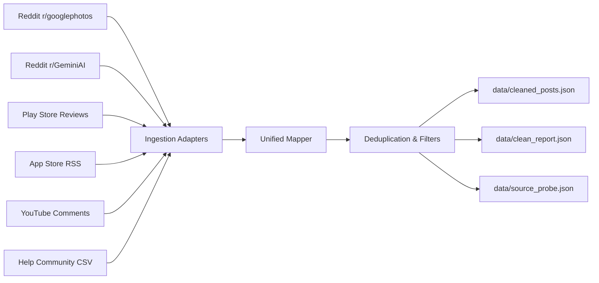
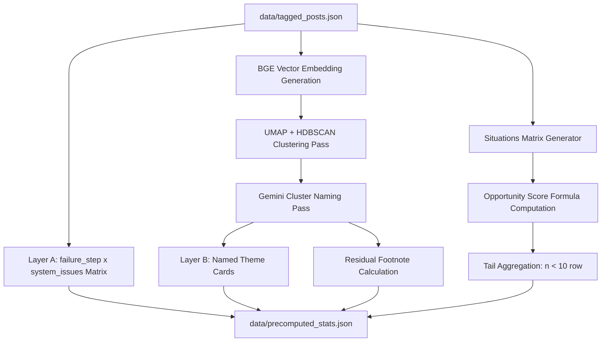
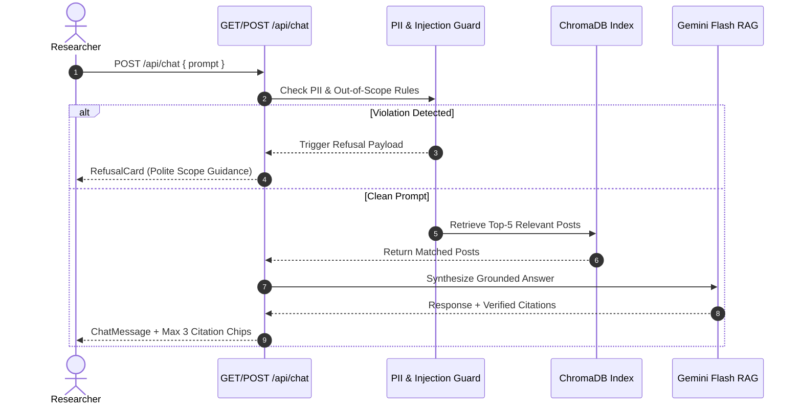

# Phase-Wise Implementation Plan: AI Discovery Engine ("Retrieval Lens")

**Product:** Google Photos Retrieval Discovery Engine ("Retrieval Lens")  
**Target Specification:** [architecture.md](file:///d:/Product%20Management/Projects/Graduation%20Project/AI%20Discovey%20Engine%20_%20AG/architecture.md) & [PRD_Discovery_Engine_v2.md](file:///d:/Product%20Management/Projects/Graduation%20Project/AI%20Discovey%20Engine%20_%20AG/PRD_Discovery_Engine_v2.md)  
**Context Documents:** [Problemstatement.txt](file:///d:/Product%20Management/Projects/Graduation%20Project/AI%20Discovey%20Engine%20_%20AG/Problemstatement.txt) | [help_community_V2.csv](file:///d:/Product%20Management/Projects/Graduation%20Project/AI%20Discovey%20Engine%20_%20AG/help_community_V2.csv) | [stitch_google_photos_review_analyzer](file:///d:/Product%20Management/Projects/Graduation%20Project/AI%20Discovey%20Engine%20_%20AG/stitch_google_photos_review_analyzer)

---

## Executive Summary & Implementation Sequence

This document provides an actionable, phase-wise implementation plan for building the **AI Discovery Engine ("Retrieval Lens")**. The implementation follows the exact build priority defined in Section 12 of the PRD and Section 13 of the Architecture Specification.

```
Phase 1: Ingestion & Cleaning  ──>  Phase 2: Tagging & Verification  ──>  Phase 3: Themes & Situations
                                                                                       │
Phase 6: RAG Chatbot           <──  Phase 5: Backend & Export         <──  Phase 4: Key Insights
        │
        v
Phase 7: Next.js Frontend UI   ──>  Phase 8: Multi-Judge (Optional)   ──>  Phase 9: Quality Bar Audit
```

### Core Execution Guarantees
1. **Zero LLM Arithmetic:** All percentages, counts, rankings, and opportunity scores are computed strictly in deterministic Python code.
2. **Idempotent Artifacts:** Every phase reads from and writes to standardized files in `data/`. Any stage can be safely re-run without duplicate ingestion or lost state.
3. **Double Verification of Quotes:** All extracted quote strings are verified via exact substring matching against source text (`quote_verified`).
4. **Stitch UI Compliance:** The frontend strictly mirrors the Google Photos / Material 3 visual identity specified in `design.md`.

---

## Phase 1: Multi-Source Data Collection & Cleaning Engine

### Objective
Ingest raw feedback across all 6 specified public sources (including the supplied `help_community_V2.csv`), normalize records to `UnifiedPostRecord`, apply cleaning and prefiltering rules, and output full audit reports (`clean_report.json` and `source_probe.json`).



### Tasks & Deliverables

#### Step 1.1: Unified Data Model & Ingestion Adapters
- [ ] Create Python data models in `backend/models/schema.py` for `UnifiedPostRecord`.
- [ ] Implement `HelpCommunityAdapter` to parse `help_community_V2.csv` (mapping `source`, `url`, `date`, `title`, `text`, `kind`).
- [ ] Implement `RedditAdapter` using Arctic Shift API for `r/googlephotos` (full history from 2022-01-01 to present + comment threads) and `r/GeminiAI` (capped at 1,000 raw posts).
- [ ] Implement `PlayStoreAdapter` using `google-play-scraper` (capped at 3,000–5,000 recent reviews, multi-country).
- [ ] Implement `AppStoreAdapter` parsing Apple customer review RSS feeds for Google Photos.
- [ ] Implement `YouTubeAdapter` targeting 15–20 selected Google Photos search videos.
- [ ] Save raw ingest outputs to `data/raw/*.json`.

#### Step 1.2: Cleaning Pipeline & Prefilter Rules
- [ ] Implement exact SHA-256 text hashing and MinHash LSH (similarity threshold 0.85) for cross-post deduplication.
- [ ] Add `fasttext` / `langdetect` filter enforcing English language (`en`).
- [ ] Implement placeholder post filtering (`[deleted]`, `[removed]`, empty body).
- [ ] Implement length floor filter discarding items under 5 words.
- [ ] Implement keyword prefilter using regex for retrieval terms:
  `\b(search|find|retrieve|missing|can't find|cannot find|look for|album|date|location|place|face|person|text|screenshot|receipt|medicine|old photo|Ask Photos)\b`

#### Step 1.3: Audit Reporting & Probe Diagnostics
- [ ] Write `clean_report.json` capturing drop counts for each rule per source.
- [ ] Write `source_probe.json` capturing records collected, records cleaned, and source status (`active` vs `uncollected` vs `failed`).
- [ ] Write normalized cleaned dataset to `data/cleaned_posts.json`.

### Verification Checkpoints
- [ ] Verify `data/cleaned_posts.json` contains non-zero valid records across all active sources.
- [ ] Verify `clean_report.json` reflects exact drop counts (no hidden drops).
- [ ] Verify `source_probe.json` distinguishes sources collected with 0 yield vs sources never attempted.

---

## Phase 2: Primary LLM Taxonomy Tagging & Code-Side Verification

### Objective
Execute primary LLM tagging using Gemini Flash against the 21-field taxonomy codebook, enforce strict code-side tag coercion and quote substring verification (`quote_verified`), and flag consistency anomalies (Rules C1–C5).

### Tasks & Deliverables

#### Step 2.1: Gemini Taxonomy Tagger
- [ ] Build `backend/tagger/gemini_tagger.py` using `google-genai` SDK with Structured JSON outputs.
- [ ] Implement 21-field taxonomy codebook prompt (fields: `relevant`, `vague_memory`, `target_type`, `primary_cue`, `cues_remembered`, `cues_forgotten`, `hedged`, `failure_step`, `memory_break`, `query_styles`, `queries_quoted`, `workarounds`, `search_tool`, `job`, `system_issues`, `outcome`, `severity`, `wish`, `unmapped_note`, `quote`, `confidence`).
- [ ] Add rate-limiting, retry logic with backoff, and Groq API fallback for quota/call failures.

#### Step 2.2: Code-Side Verification & Tag Coercion
- [ ] Build `backend/tagger/verifier.py` to coerce invalid enum outputs to default `"unclear"` / `"other"` values and log warnings.
- [ ] Implement `quote_verified` check: exact normalized substring search of extracted `quote` and `queries_quoted` against original post text. Mark `quote_verified: true/false`.

#### Step 2.3: Appendix B Consistency Rules Engine
- [ ] Implement automated rule checks in `backend/tagger/consistency.py`:
  - **C1:** `failure_step == 'no_failure'` but `outcome == 'not_found'` or `severity != 'low'`.
  - **C2:** `failure_step == 'did_not_search'` but `queries_quoted` is non-empty.
  - **C3:** `vague_memory == 'precise'` but `cues_forgotten` is non-empty.
  - **C4:** `workarounds` contains `'gave_up'` but `outcome == 'found_eventually'`.
  - **C5:** Same cue string present in both `cues_remembered` and `cues_forgotten`.
- [ ] Output finalized dataset to `data/tagged_posts.json`.

### Verification Checkpoints
- [ ] Confirm all records in `data/tagged_posts.json` possess valid 21-field schemas.
- [ ] Verify no unverified quotes (`quote_verified == false`) are marked as verified.
- [ ] Run consistency auditor and verify flagged posts are logged into `data/consistency_flags.json`.

---

## Phase 3: Dual-Layer Themes & Situations Precomputation Engine

### Objective
Generate the Themes matrix (Layer A failure step heatmap & Layer B emergent cluster cards) and the Situations matrix (with deterministic Opportunity Scores and small-sample aggregation).



### Tasks & Deliverables

#### Step 3.1: Secondary BGE Embedding & Clustering Engine
- [ ] Build `backend/analysis/cluster_engine.py` using `sentence-transformers` (`BAAI/bge-small-en-v1.5`).
- [ ] Embed `title + " " + raw_text` into 384-dimensional dense vectors for all relevant posts.
- [ ] Run UMAP dimension reduction and HDBSCAN clustering (`min_cluster_size=12`).
- [ ] Prompt Gemini Flash to generate narrative cluster titles from sample posts per cluster.

#### Step 3.2: Dissolving Residuals & Section 4.3 UI Exclusion Rule
- [ ] Attempt cluster matching for posts with `target_type == 'other'` or `failure_step == 'unclear'`.
- [ ] Calculate residual unclassified count ($n$) and percentage share.
- [ ] Enforce rule: store residual stats strictly as a footnote (`residual_disclosure`), never as a ranked bar in Themes charts.

#### Step 3.3: Themes Layer A Heatmap Computation
- [ ] Compute 2D crosstab matrix of `failure_step` × `system_issues` with exact counts and percentage shares of total relevant posts.

#### Step 3.4: Situations Matrix & Opportunity Score Engine
- [ ] Group relevant posts by composite key: `target_type` × `primary_cue` × `job`.
- [ ] Filter groups: rows with $n \ge 10$ remain distinct; rows with $n < 10$ are merged into `"Other (fewer than 10 posts)"`.
- [ ] Implement deterministic Opportunity Score algorithm:
  $$\text{Share}(s) = \frac{n_s}{N_{\text{relevant}}}$$
  $$\text{Avg Severity}(s) = \frac{\sum \text{SeverityWeight}}{n_s} \quad (\text{Low}=1, \text{Med}=2, \text{High}=3)$$
  $$\text{Unresolved Rate}(s) = \frac{|\{i \in s \mid \text{outcome} = \text{'not\_found'} \lor \text{'gave\_up'} \in \text{workarounds}\}|}{n_s}$$
  $$\text{Opportunity Score}(s) = \min\left(100, \text{Round}\left(\frac{\text{Share} \times \text{Avg Severity} \times \text{Unresolved Rate}}{\text{Max Raw Score}} \times 100\right)\right)$$

### Verification Checkpoints
- [ ] Verify Opportunity Scores range cleanly between 0 and 100 with default sort ordering by score.
- [ ] Verify groups with $n < 10$ are cleanly combined into the tail aggregation row.
- [ ] Verify residual bucket is excluded from ranked Theme bars and formatted as a footnote.

---

## Phase 4: Key Insights Precomputation Engine (9 Research Questions)

### Objective
Precompute statistical summaries, verbatim query tables, and grounded LLM synthesis for all 9 PRD research questions, enforcing $n < 10$ fallback safeguards.

### Tasks & Deliverables

#### Step 4.1: Question Statistics Aggregation
- [ ] Build `backend/analysis/insights_engine.py` to aggregate empirical distributions for:
  - **Q1 (Photo Types):** `target_type` among non-`no_failure` posts.
  - **Q2 (Remembered Cues):** `cues_remembered` distribution.
  - **Q3 (Forgotten Cues):** `cues_forgotten` distribution.
  - **Q4 (Search Formulation):** `query_styles` & verbatim `queries_quoted` for `vague_memory == 'vague'`.
  - **Q5 (Expressibility):** `failure_step == 'search_not_completed'` × `memory_break == 'could_not_put_into_words'`.
  - **Q6 (System Comprehension):** `failure_step == 'no_or_wrong_results'` × `system_issues`.
  - **Q7 (Result Evaluation):** `failure_step == 'results_not_recognized'` & `wrong_photo_opened`.
  - **Q8 (Refinement Friction):** `workarounds` distribution (`scroll_timeline`, `gave_up`).
  - **Q9 (KPI Tree Breakage):** `failure_step` distribution mapped to static KPI reference table (Appendix C).

#### Step 4.2: Grounded LLM Summary Generation
- [ ] Write prompt in `backend/analysis/summary_writer.py` feeding *only* precomputed numbers and verified quotes to Gemini Flash.
- [ ] Instruct model to write concise, factual summaries without introducing external numbers or unevidenced assertions.

#### Step 4.3: Low Evidence Safeguard Implementation
- [ ] Implement fallback check: if $n < 10$ or primary tag is `unclear` for >50% of records, override summary text with:
  > *"There isn't enough evidence in the collected data to answer this confidently (n=X). This should be validated through user research."*

### Verification Checkpoints
- [ ] Verify all 9 questions produce structured JSON cards in `data/precomputed_stats.json`.
- [ ] Verify any question card with $n < 10$ displays the exact fallback warning text.
- [ ] Verify static KPI tree mapping table matches Appendix C definitions.

---

## Phase 5: FastAPI Backend Services & Self-Describing Export Bundle

### Objective
Expose precomputed analytics via a high-performance REST API and build the self-describing JSON export bundle generator.

### Tasks & Deliverables

#### Step 5.1: FastAPI Core Server Setup
- [ ] Create `backend/main.py` with FastAPI, CORS middleware, and environment variable config loading.
- [ ] Load `data/precomputed_stats.json`, `data/source_probe.json`, and `data/clean_report.json` into memory on startup.

#### Step 5.2: API Endpoints Implementation
- [ ] `GET /api/overview`: Pipeline step counts, stat cards, and source health array.
- [ ] `GET /api/themes`: Layer A heatmap matrix, Layer B named clusters, and residual footnote.
- [ ] `GET /api/situations`: Ranked situation rows, tail aggregation row, and opportunity score formula.
- [ ] `GET /api/insights`: 9 research question cards with charts, summaries, and quotes.
- [ ] `GET /api/method`: Full pipeline drop counts, source limitations, model versions, and tag glossary.

#### Step 5.3: Self-Describing Dashboard Bundle Exporter
- [ ] Build `backend/exporter/bundle_builder.py` generating `retrieval_lens_analysis_bundle.json`.
- [ ] Include self-describing human-readable field glossary, pipeline probe metrics, themes, situations, key insight summaries, and example quotes.
- [ ] Expose `GET /api/export` endpoint serving the JSON bundle attachment.

### Verification Checkpoints
- [ ] Test all GET endpoints return standard HTTP 200 responses with valid JSON schemas matching [architecture.md](file:///d:/Product%20Management/Projects/Graduation%20Project/AI%20Discovey%20Engine%20_%20AG/architecture.md#9-data-schemas--api-contract-specifications).
- [ ] Verify exported JSON bundle is fully self-describing and readable without backend code.

---

## Phase 6: RAG Chatbot Subsystem ("Ask the Data")

### Objective
Build vector indexing in ChromaDB, PII scrubbing, out-of-scope refusal handling, and an evidence-grounded RAG chatbot providing up to 3 verified quote citations per response.



### Tasks & Deliverables

#### Step 6.1: Vector DB Indexing
- [ ] Build `backend/rag/vector_store.py` initializing persistent ChromaDB client.
- [ ] Index all relevant post embeddings with metadata (`post_id`, `source`, `url`, `date`, `quote`).

#### Step 6.2: Safety, PII Scrubbing & Injection Guards
- [ ] Build `backend/rag/guardrails.py` with regex scrubbers for emails, phone numbers, and IDs.
- [ ] Implement jailbreak detection filtering system prompt override attempts.
- [ ] Implement out-of-scope classifier detecting queries on competitors, revenue, or demographics.

#### Step 6.3: Grounded Answer Generator & Citation Engine
- [ ] Build `backend/rag/rag_engine.py` querying ChromaDB ($n=5$) and injecting precomputed stats context into Gemini Flash.
- [ ] Format answers to extract **up to 3 exact verified quote citations** (`CitationChip` payload).
- [ ] Append mandatory sample disclosure text to every answer:
  > *"Answers come only from the public posts we collected (n=X sample). Not a measure of all Google Photos users."*

### Verification Checkpoints
- [ ] Test PII input (e.g., email address) and verify execution halts with rephrase prompt.
- [ ] Test out-of-scope query (e.g., "Apple Photos market share") and verify structured `RefusalCard` is returned.
- [ ] Verify all valid chat answers include at most 3 citation chips linking to original source URLs.

---

## Phase 7: Frontend Web Application (Next.js / Material 3)

### Objective
Develop the Next.js App Router application integrating Stitch visual designs, Google Photos Material 3 design tokens (`#4285F4`, `#EA4335`, `#FBBC04`, `#34A853`), and responsive navigation rail layout.

### Tasks & Deliverables

#### Step 7.1: Next.js Setup & Design System Tokens
- [ ] Initialize Next.js 14 App Router project in `frontend/`.
- [ ] Configure `tailwind.config.js` / CSS variables with exact Material 3 Google Photos colors:
  - **Blue:** Base `#4285F4`, Tint `#E8F0FE`
  - **Red:** Base `#EA4335`, Tint `#FCE8E6`
  - **Yellow:** Base `#FBBC04`, Tint `#FEF7E0`
  - **Green:** Base `#34A853`, Tint `#E6F4EA`
  - **Neutrals:** Background `#F8F9FA`, Surface `#FFFFFF`, Text `#202124`
- [ ] Set typography to Google Sans / Roboto (floor 14px text size) and card border radius to 16px.

#### Step 7.2: Reusable UI Components Implementation
- [ ] `StatCard`: Headline number + tint background + supporting label.
- [ ] `PipelineStep`: Horizontal step node with live record counts.
- [ ] `ThemeCard`: Named cluster card with post count, share bar, and quote chips.
- [ ] `QuoteCard`: Verified quote snippet with source icon badge and original link.
- [ ] `SituationsTable`: Ranked table with 3-step severity indicators and opportunity score progress bar.
- [ ] `CollapsibleInsightCard`: Accordion Q&A card supporting evidence quotes and "Not enough evidence" state.
- [ ] `ChatMessage` & `CitationChip`: RAG chat bubble with clickable citation chips opening evidence panel.
- [ ] `RefusalCard`: Calm, distinct card state for out-of-scope/PII chatbot refusals.
- [ ] `DownloadDashboardButton`: Persistent top-bar export button.

#### Step 7.3: Screen Pages Assembly
- [ ] `app/overview/page.tsx`: Pipeline step diagram, 4 stat cards, source health row.
- [ ] `app/themes/page.tsx`: Section A heatmap chart + Section B emergent theme cards + residual footnote.
- [ ] `app/situations/page.tsx`: Sortable situations table + opportunity formula caption + tail row.
- [ ] `app/insights/page.tsx`: 9 collapsible insight cards with charts and quote rows.
- [ ] `app/ask-data/page.tsx`: Interactive chat view + persistent disclaimer + example prompt chips.
- [ ] `app/method/page.tsx`: Interactive pipeline breakdown + source limits table + model metadata + tag glossary.
- [ ] Add persistent demo data banner ("Demo data — for layout preview only") toggled via environment flag.

### Verification Checkpoints
- [ ] Audit frontend against all Section 10 quality rules (zero raw enums, wrapped labels, explicit % headers).
- [ ] Verify navigation rail switches pages smoothly across desktop (1024px+) and mobile (390px) viewports.

---

## Phase 8: Multi-LLM Judge & Human Validation Subsystem (Optional)

### Objective
Build the optional quality verification subsystem using Groq (Judge A) for blind re-tagging, Gemini 1.5 Pro (Judge B) for tiebreakers, and human validation ground-truth overrides.

### Tasks & Deliverables

#### Step 8.1: Blind Multi-Judge Pipeline
- [ ] Build `backend/judge/groq_judge.py` re-tagging a random sample of 150–200 posts blind using Groq (Llama-3.3-70b).
- [ ] Implement agreement checker comparing Primary Tagger vs. Judge A tags.
- [ ] Build `backend/judge/gemini_tiebreaker.py` running Gemini 1.5 Pro on disagreement cases.

#### Step 8.2: Dispute Resolution & Human Override Engine
- [ ] Calculate final consensus tag: majority vote among taggers or assign `disputed: true` flag.
- [ ] Create CLI/UI adapter to load human ground-truth labels (`data/human_labels.json`) overriding model tags.
- [ ] Output metrics to `data/judge_validation_report.json`.

#### Step 8.3: Dynamic Quality Page & Pipeline Step Update
- [ ] Build `app/quality/page.tsx` displaying inter-judge agreement rates and human validation accuracy.
- [ ] Dynamically append `[Checked (Judges + Human): N]` node to the Overview page pipeline diagram *only* when validation has been executed.

### Verification Checkpoints
- [ ] Verify `/quality` nav item and pipeline step remain completely hidden when judge pass has not run.
- [ ] Verify human labels successfully override machine tags in consensus reports.

---

## Phase 9: End-to-End Verification & Non-Negotiable Quality Bar Audit

### Objective
Execute comprehensive end-to-end verification across the entire system against Section 10 non-negotiable quality rules before declaring completion.

### Section 10 Quality Bar Checklist

| Audit ID | Quality Bar Requirement | Verification Method | Pass / Fail |
|---|---|---|---|
| **Q-01** | **No Missing Categories:** All enum values with $n \ge 1$ are rendered in charts without silent omissions. | Compare raw `data/precomputed_stats.json` keys against DOM rendered chart elements. | [ ] Pending |
| **Q-02** | **Zero Raw Enums:** No raw string keys (e.g., `document_info`, `no_or_wrong_results`) appear anywhere on screen. | Run automated UI string scanner for raw enum patterns. | [ ] Pending |
| **Q-03** | **No Truncated Labels:** Axis labels and column headers wrap onto multiple lines without mid-word ellipsis. | Visual inspection across 390px, 768px, and 1440px breakpoints. | [ ] Pending |
| **Q-04** | **Explicit Percentage Headers:** Percentage headers state exact denominators (e.g., `"% of relevant posts (n=512)"`). | Inspect table and chart header text strings across all pages. | [ ] Pending |
| **Q-05** | **Source Status Differentiation:** Zero-yield collected sources distinct from uncollected sources. | Verify `source_probe.json` status codes render distinct badge styles. | [ ] Pending |
| **Q-06** | **Collapsible Deep-Dives:** Tables longer than 8 rows use expandable summary cards. | Verify Situations & Key Insights pages use accordion wrappers. | [ ] Pending |
| **Q-07** | **Quote Verification:** Only quotes with `quote_verified == true` are displayed in UI cards. | Audit rendered QuoteCards against source substring verifier log. | [ ] Pending |

---

## Summary of Output Files & Artifact Directory Structure

```
d:\Product Management\Projects\Graduation Project\AI Discovey Engine _ AG\
├── PRD_Discovery_Engine_v2.md         # Core Product Requirements Document
├── Problemstatement.txt               # Context & Problem Statement
├── architecture.md                    # System Architecture Specification (v2.0.0)
├── implementation_plan.md             # This Phase-Wise Plan
├── help_community_V2.csv              # Provided Google Photos Support Dataset
├── data/                              # Pipeline Output Artifacts
│   ├── raw/                           # Raw multi-source ingested JSON files
│   ├── cleaned_posts.json             # Standardized, deduplicated cleaned posts
│   ├── clean_report.json              # Dropped records audit report
│   ├── source_probe.json             # Per-source volume & health tracking
│   ├── tagged_posts.json              # 21-field LLM tagged & code-verified records
│   ├── precomputed_stats.json         # Aggregated metrics for UI & API
│   ├── retrieval_lens_analysis_bundle.json # Downloadable self-describing export
│   └── chroma_db/                     # Vector DB index for RAG chatbot
├── backend/                           # Python FastAPI Service
│   ├── main.py                        # FastAPI application entrypoint
│   ├── models/                        # Pydantic schemas & data models
│   ├── ingest/                        # Source adapters & cleaning scripts
│   ├── tagger/                        # Gemini LLM tagger & quote verifier
│   ├── analysis/                      # Themes, Situations & Insights engines
│   ├── rag/                           # ChromaDB vector store & RAG chatbot
│   └── exporter/                      # Self-describing bundle builder
└── frontend/                          # Next.js 14 App Router UI (Material 3)
    ├── app/                           # Page routes (Overview, Themes, Situations, etc.)
    └── components/                    # Material 3 UI component library
```
